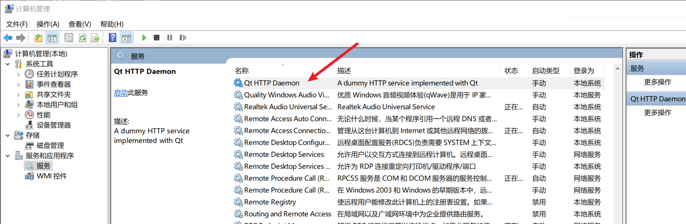

# 测试 qtservice example

1. 导入工程 qtservice.pro

2. 编译生成

3. 在 httpservice.exe 目录下进入 bash 终端

4. windeployqt

   ```bash
   /c/Qt/5.15.2/msvc2019_64/bin/windeployqt.exe ./httpservice.exe
   ```

5. run with help

   ```bash
   $ ./httpservice.exe -h
   
   D:\NWork\qt-solutions\build-qtservice-Desktop_Qt_5_15_2_MSVC2019_64bit-Release\examples\server\release\httpservice.exe -[i|u|e|t|p|r|c|v|h]
           -i(nstall) [account] [password] : Install the service, optionally using given account and password
           -u(ninstall)    : Uninstall the service.
           -e(xec)         : Run as a regular application. Useful for debugging.
           -t(erminate)    : Stop the service.
           -p(ause)        : Pause the service.
           -r(esume)       : Resume a paused service.
           -c(ommand) num  : Send command code num to the service.
           -v(ersion)      : Print version and status information.
           -h(elp)         : Show this help
           No arguments    : Start the service.
   ```

6. try install service

   ```bash
   $ ./httpservice.exe -i
   The service Qt HTTP Daemon could not be installed
   ```

7. failed, reopen bash terminal as Administrator, and install service

   ```bash
   $ ./httpservice.exe -i
   The service Qt HTTP Daemon has been installed under: D:\NWork\qt-solutions\build-qtservice-Desktop_Qt_5_15_2_MSVC2019_64bit-Release\examples\server\release\httpservice.exe
   ```

8. 在计算机管理里面查看服务情况

   

9. 使用 controller.exe

   ```bash
   $ ./controller.exe -h
   controller [-i PATH | SERVICE_NAME [-v | -u | -s | -t | -p | -r | -c CODE] | -h] [-w]
   
           -i(nstall) PATH : Install the service
           -v(ersion)      : Print status of the service
           -u(ninstall)    : Uninstall the service
           -s(tart)        : Start the service
           -t(erminate)    : Stop the service
           -p(ause)        : Pause the service
           -r(esume)       : Resume the service
           -c(ommand) CODE : Send a command to the service
           -h(elp)         : Print this help info
           -w(ait)         : Wait for keypress when done
   ```

10. 使用 controller.exe 控制启动 Qt HTTP Daemon 服务(管理员权限) 1234 为端口号

   ```
   $ ./controller.exe "Qt HTTP Daemon" -s 1234
   The service "Qt HTTP Daemon" was started.
   ```

   

11. 浏览器访问：http://127.0.0.1:1234 , 虽然访问有问题，但是表现和 输入其他地址不同，暂不探究其错误原因。